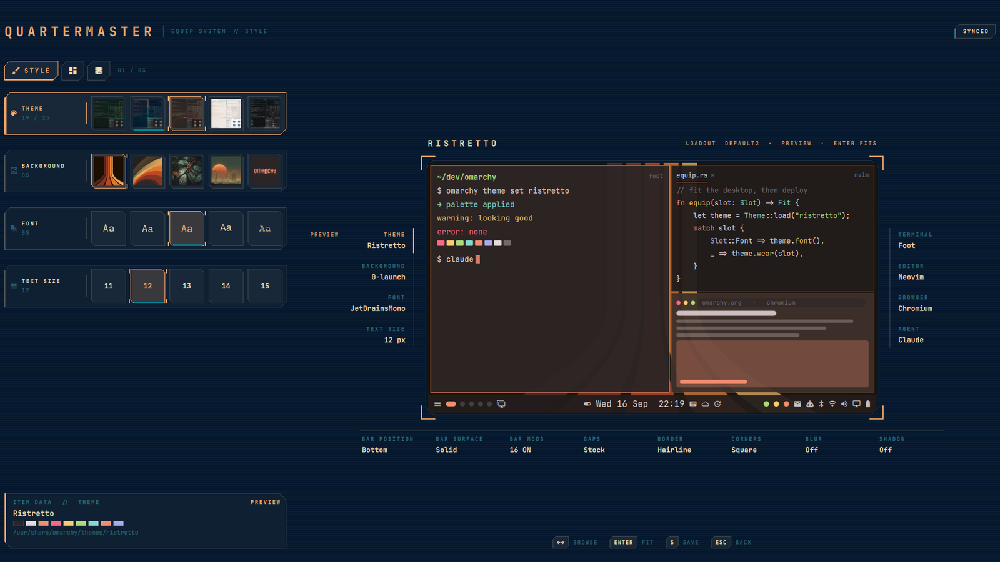
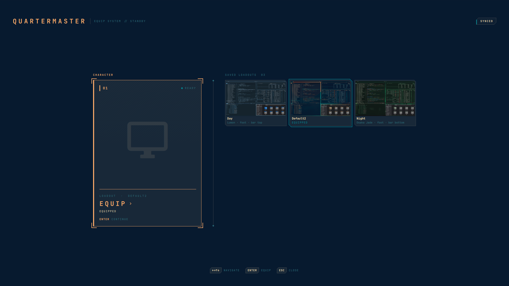
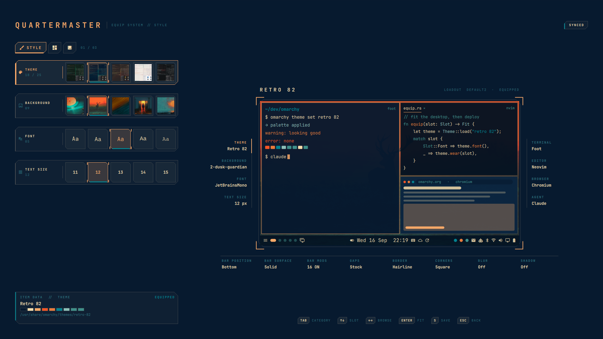
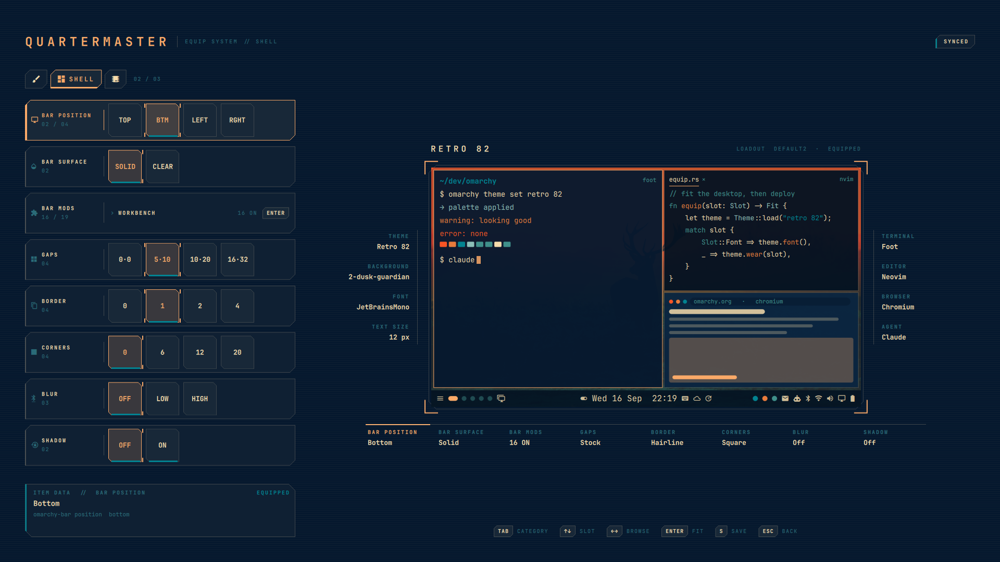
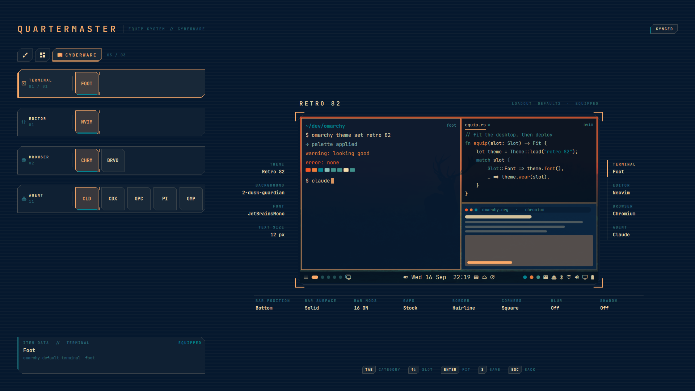
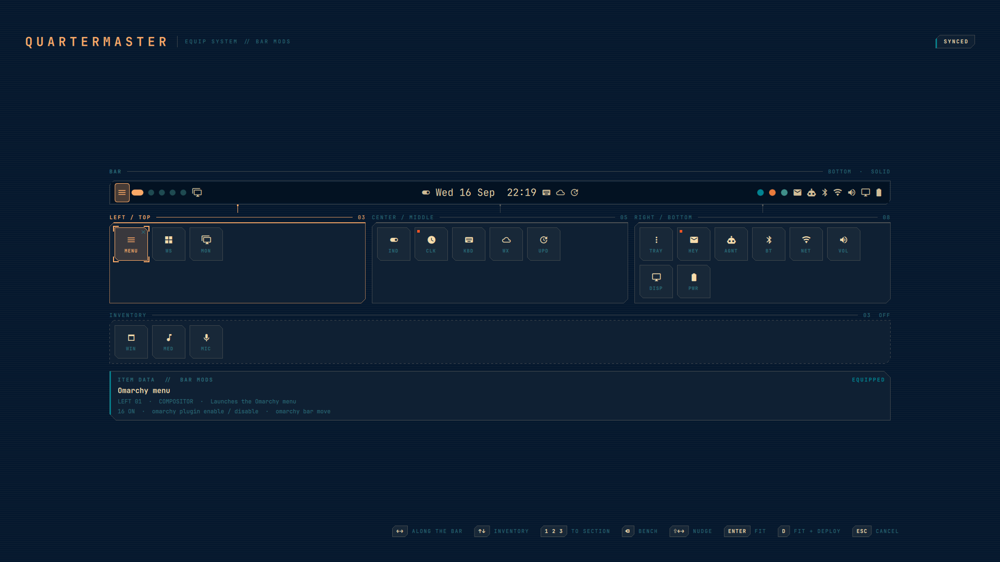

# Quartermaster

An RPG equip screen for Omarchy. Slot in themes, backgrounds, fonts, default
apps, the bar and Hyprland's own look — gaps, borders, corners, blur, shadow —
watch a miniature desktop re-fit itself as you browse, fit what you like, then
deploy the whole fitting for real. Save a fitting as a loadout and swap
between them in one move.



## Install

```sh
omarchy plugin add https://github.com/pantherdev2024/Quartermaster.git --enable
```

Adding shows you the code before anything runs, and a plugin lands disabled
unless you pass `--enable`. Once it is on, the screen answers to the shell:

```sh
omarchy-shell shell toggle io.github.pantherdev2024.quartermaster
```

That command is the whole interface. It is also the only way in a plugin can
offer on its own, because a manifest cannot claim a key or a menu row, so the
two comfortable ways in are yours to add. Both are one line.

A keybinding, in `~/.config/hypr/bindings.lua`:

```lua
o.bind("SUPER + SHIFT + L", "Quartermaster", "omarchy-shell shell toggle io.github.pantherdev2024.quartermaster")
```

A row under **Style** in the Omarchy menu, in
`~/.config/omarchy/extensions/omarchy-menu.jsonc`:

```jsonc
"style.quartermaster": {"icon":"󰆓","label":"Quartermaster","aliases":["quartermaster","loadout","equip"],"description":"Equip themes, backgrounds and fonts with a live preview","action":"omarchy-shell shell toggle io.github.pantherdev2024.quartermaster"},
```

## What it needs and what it touches

Nothing beyond Omarchy itself. `jq`, Hyprland, Quickshell and the JetBrains
Mono Nerd Font the glyphs are drawn from are already hard dependencies of the
`omarchy` package; everything else the scripts reach for is coreutils. There is
no service to start, no installer, no remote build, and no network access at
any point.

What it does have is your desktop, so it is worth being plain about which half
of the screen does what. Browsing and fitting are inert — they repaint the mock
desktop and touch nothing else. Only `D` runs anything, and what it runs are
the ordinary Omarchy commands, the same ones the Omarchy menu runs:
`omarchy-theme-set`, `omarchy-theme-bg-set`, `omarchy-font-set`,
`omarchy-display-text-size`, `omarchy-bar position` and `transparent`,
`omarchy plugin enable` / `disable`, `omarchy bar move`, and
`omarchy-default-terminal` / `-editor` / `-browser`. Each is handed its
arguments as a list rather than a shell string, and every value in that list is
an id the inventory itself produced. The five Hyprland look slots run the
plugin's own `look-set.sh`, described under Hyprland look below; it writes one
file under `~/.local/state` and runs `hyprctl reload`.

Opening the screen only reads: those same commands with no argument, plus
`omarchy-plugin-catalog`, `~/.config/omarchy/shell.json`, the two theme
directories, and the current-theme and current-background links. Where Omarchy
ships an `omarchy-installed-service-*` check, that runs too, under a two second
timeout — which is what keeps a widget with nothing behind it out of the
catalogue.

Quartermaster writes in four places of its own: saved loadouts under
`~/.local/share/omarchy/loadouts/`, a log, the last deploy's result and the
chosen look presets under `~/.local/state/omarchy/loadout/`, the rendered look
file `~/.local/state/omarchy/toggles/hypr/quartermaster-look.lua`, and the
default agent in `~/.config/omarchy/defaults/agent`, written directly for the
reason given under Categories and slots. Nothing under `~/.config/hypr` is
ever touched.

The loadout store is the one directory that takes files from outside. Saved
loadouts are meant to be synced, and saying that is saying files arrive in it
from other machines, so nothing in it is read on trust. The directory is
checked once per run to be a real directory rather than a link standing in for
one, to belong to this user, and to be closed to everyone else; one that fails
is reported empty rather than read, and is not written to at all. That check
is of the directory itself: a link further up the path is not something a
shell script can rule out, because it cannot hold a directory open and work
relative to it the way a compiled program would. A listing
reads only regular files it opened itself, verifying after the open that the
descriptor holds the file the name referred to, and stops at fixed limits on
file count, bytes per file and bytes in total, because the process paying for
that read is the shell itself. A save is published by renaming a freshly
created file over its destination rather than writing through the
destination's name, so it cannot be redirected by a link left at that name,
never leaves half a loadout behind, and never destroys the old one before the
new one exists. A destination that is anything other than absent or a plain
file is refused rather than replaced.

Every other file the plugin writes goes the same way, through `safe-io.sh`,
which is where these scripts read and write anything they did not put there
themselves. The
directory is verified before it is used and is never used if anybody else can
write into it; the file is replaced by renaming a freshly created one over it
rather than by redirecting output at its name; and a link found where a file
was expected stops the write rather than being followed, because in a
directory this plugin manages that is evidence rather than an accident. The
deploy log is opened once, before the first command runs, and every line after
that goes to the descriptor rather than reopening the name.

None of this asks for root: no sudo or pkexec is used anywhere in the plugin,
and Omarchy's installer never runs plugin code. What is true of every
Omarchy plugin is true of this one, though — it shares the long-running
`omarchy-shell` process and runs unsandboxed with your user's permissions, so
read the code before you enable it.

## Remove

```sh
omarchy plugin remove io.github.pantherdev2024.quartermaster
```

That deletes the plugin from `~/.config/omarchy/plugins` and turns it off,
and it undoes none of what you deployed. One thing it does not do is prune the
plugin's settings record from the `plugins` array in `shell.json`; that entry
is inert once the folder is gone, but if you want it tidy, take the object
with this plugin's `id` out by hand.

Every change Quartermaster makes it makes by running the ordinary Omarchy
command, so a theme, font or default it applied stays applied exactly as if
you had run that command yourself.

Two directories are yours rather than the plugin's, so they are left where
they are and a reinstall finds your loadouts again:

- `~/.local/share/omarchy/loadouts/` — one JSON file per saved loadout
- `~/.local/state/omarchy/loadout/` — the deploy log, the last result and the
  chosen look presets

One file keeps working after removal, on purpose: a deployed Hyprland look
lives in `~/.local/state/omarchy/toggles/hypr/quartermaster-look.lua`, which
Omarchy loads on its own, so the gaps or corners you deployed stay exactly as
deployed, the way a theme you deployed does. Fit every look slot back to stock
before removing, or delete that one file afterwards, and Hyprland is back to
your `looknfeel.lua` alone.

Delete those by hand if you want them gone, and take the binding and the menu
row back out of your own config.

## Usage

- Summon it with the command above, or with whichever of the binding and the
  menu row you set up
- It opens on the boot screen: the character on a card to the left, the
  saved loadouts as a grid to the right. `← → ↑ ↓` move between them.
  `ENTER` on the card continues to the equip screen. On a loadout, `ENTER`
  fits every slot it recorded and stays, so `D` deploys it from right there;
  `E` (or EDIT on the tile) fits it and continues to the equip screen to
  change it; `X` (or the cross) deletes it, after asking
- `TAB` / `SHIFT+TAB` (or `1` `2` `3`) switch equipment category
- `↑ ↓` move between slots, `← →` browse that slot's inventory
- BAR MODS has no inventory to browse: `← →` do nothing there and `ENTER`
  opens its workbench, which takes over the screen
- `ENTER` fits the item under the cursor into its slot
- `D` deploys the fitting for real and closes the screen, from either
  screen; clicking the pill in the top corner does the same
- `ESC` steps back from the equip screen to the boot screen and closes from
  there; if anything is fitted but not deployed it asks first
- `S` saves the fitting on screen as a loadout: a chooser offers the saved
  loadouts to save over, with the one the fitting came from first, and NEW
  at its head for a fresh name. Nothing is saved under a new name unasked



The screen opens on Hyprland's focused monitor. A summon payload can name an
output instead, which is handy for scripting and screenshots:

```
omarchy-shell shell toggle io.github.pantherdev2024.quartermaster '{"screen":"eDP-1"}'
```

Three steps, on purpose. **Browsing previews**: the mini desktop repaints as
you arrow along a row and nothing else moves; leave the slot without fitting
and the preview snaps back. **ENTER fits**: the item locks into the slot and
the fitting is what you are building, still touching nothing. **D deploys**:
the fitting's commands run and the screen closes. Nothing on the real system
changes before D.

Theme and background are the exception: they repaint on the fit rather than on
the browse. Arrowing along those two rows moves the cursor and names the item,
and the mock desktop follows once you press `ENTER`, where every other row
follows the cursor itself. Fitting is still free — it touches nothing real and
`ESC` discards it — so trying a theme on and backing out costs a keypress
rather than a change.

## Categories and slots

Slots are grouped into three categories, picked from the glyph pills across
the top of the left column. The active pill spells out its name.

| Category | Slot | Inventory source | Applied with |
|----------|------|------------------|--------------|
| **Style** | Theme | `~/.config/omarchy/themes` + `/usr/share/omarchy/themes` | `omarchy-theme-set` |
| | Background | the fitted theme's `backgrounds/` | `omarchy-theme-bg-set` |
| | Font | `omarchy font list` | `omarchy-font-set` |
| | Text size | 9–20 px | `omarchy-display-text-size` |
| **Shell** | Bar position | top / bottom / left / right | `omarchy-bar position` |
| | Bar surface | solid / transparent | `omarchy-bar transparent` |
| | Bar mods | every usable `bar-widget` plugin in the catalogue | `omarchy plugin enable` / `disable`, `omarchy bar move` |
| | Gaps | tight / stock / airy / loose | `look-set.sh gaps` |
| | Border | none / hairline / stock / heavy | `look-set.sh border` |
| | Corners | square / soft / round / pill | `look-set.sh corners` |
| | Blur | off / light / heavy | `look-set.sh blur` |
| | Shadow | off / on | `look-set.sh shadow` |
| **Cyberware** | Terminal | installed alacritty / foot / ghostty / kitty | `omarchy-default-terminal` |
| | Editor | installed editors `omarchy default editor` knows | `omarchy-default-editor` |
| | Browser | installed browsers `omarchy default browser` knows | `omarchy-default-browser` |
| | Agent | the coding agents `omarchy default agent` knows, when present | `agent-set.sh` |

Style is what the desktop wears — its palette, its wallpaper and its type,
face and size together — Shell is the frame it hangs on, and Cyberware is the
tooling wired into it. All three show on the mini desktop: it repaints, scales
its type, moves its bar, drops the bar fill, mirrors the bar's widget layout,
spaces and rounds and borders its windows the way Hyprland would, and names
the fitted terminal, editor, browser and agent in its windows — everything as
you browse, except the palette and the wallpaper, which follow once you fit
them.

### Hyprland look

Gaps, border, corners, blur and shadow are Hyprland settings, and Omarchy has
no command that sets them, so these five slots come with their own apply
script. Every value they can set lives in `look-presets.json`; the slot and
the preset are looked up there and rejected if absent, and nothing else is
ever written. Deploying one records the choice in
`~/.local/state/omarchy/loadout/look.json` and renders the whole record as one
`hl.config` call into `~/.local/state/omarchy/toggles/hypr/quartermaster-look.lua`,
which Omarchy itself loads after your `~/.config/hypr/looknfeel.lua` (that
directory is Omarchy's own drop-in for permanent flags). Then `hyprctl reload`,
then `hyprctl configerrors`: an error that was not there before the write
means the file is withdrawn, the previous one restored and Hyprland reloaded
again, so a bad render cannot leave the desktop in a broken state.

A slot fitted with its stock preset is left out of the file, so your own
looknfeel.lua keeps the last word there, and fitting every look slot back to
stock removes the file. Delete that one file and Hyprland is back to your
config alone. The slots read what Hyprland is actually running over
`hyprctl getoption`; when it matches no preset, a Custom item shows the live
values as equipped rather than mislabelling them as the nearest preset. Blur
only shows on windows that let something through, which stock Omarchy
windows barely do.







### Deploying

`D` hands the fitting to `deploy.sh`, which runs one command per fitted
slot, in a fixed order: theme first (the background depends on it), then the
Hyprland look, the bar and text size, then the default apps, and the font
last. The
font goes last because `omarchy-font-set` restarts the shell, and Quartermaster
lives inside the shell: anything still queued there would die with it. For
the same reason the runner is detached from the shell (`setsid -f`), and
the screen closes before the commands run. The runner reports back with a
desktop notification ("Quartermaster deployed · 3 changes", or which command
failed), a log in `~/.local/state/omarchy/loadout/deploy.log`, and a result
file the next open folds into the status pill.

### Bar mods

Bar mods is the one multi-select slot. What it holds is not an item off a row
but a whole arrangement, so it has no inventory to browse: in its place sits a
button that opens the workbench, with what the bar currently carries beside it.
Its value is the whole layout as one string (`left:a,b|center:c|right:d`), so
previewing, fitting, saving and "is it live" work exactly as for every other
slot, and a saved loadout records the entire bar arrangement. On the button,
the item data panel describes the slot rather than a widget: how the fitting
is spread across the bar and the bench.

`ENTER` on the slot, or a click on the button, opens the **workbench**, which
takes the whole screen: bar mods edits the whole bar, so the slot column and
the character stand down while it is open. It is laid
out in the shape of the thing it edits. Across the top is the **rail** — the
fitting drawn as a bar, in the previewed theme, tagged with the edge the bar
is really on and whether it is solid; a clear bar lets the previewed wallpaper
through exactly as it would on the desktop. Under it sit the three section
bins, LEFT, CENTER and RIGHT, as equal thirds of the rail, each tethered to
the stretch of rail it governs; under those, one **inventory** pane the rail's
full width holding everything that is off; and at the foot, the item data
panel for the tile under the cursor. Tiles shrink from 64px to a floor of 38
until all of it fits the screen, so the workbench never scrolls.



A vertical bar still draws as a horizontal rail. LEFT, CENTER and RIGHT are
the bar's own section names rather than directions on the screen, so they keep
those names whichever edge the bar is on, and the rail's tag says which edge
that is. On a vertical bar those sections land at the top, the middle and the
bottom of the screen, so each bin carries that name too — `LEFT / TOP`,
`CENTER / MIDDLE`, `RIGHT / BOTTOM` — and you can read the bin either way
without having to hold the mapping in your head.

Drag a tile into a bin, between two tiles, or back to the inventory, or take
it off the bar with the small cross that comes up in its corner — the same
cross a saved-loadout card carries, shown while the pointer or the keyboard
cursor is on the tile. A tile in the inventory is already off, so it gets
none. With the keyboard, `← →` walk the whole bar — off the end of LEFT into CENTER, off the
end of RIGHT back to the start — and walk the inventory when the cursor is
there; `↑ ↓` cross between the bar and the inventory, landing on whatever tile
stands nearest in the cursor's column; `1` `2` `3` send the tile under the
cursor to a section, `BACKSPACE` benches it, `SHIFT+← →` nudge it along,
`SPACE` toggles. All of that edits the preview, and the rail follows: the
widget under the cursor lights on the rail as well as in its bin, so a tile
and its real place on the bar read as the same thing. Hovering a token on the
rail moves the cursor to it. `ENTER` fits the arrangement and closes the
workbench, `ESC` drops the preview, `D` fits and deploys. The bins are data,
so another slot could open a workbench of its own.

Deploying diffs the live layout against the fitted one and runs, in order:
`omarchy plugin disable` for every widget leaving, `omarchy plugin enable
--section --index` for every widget joining at its final spot, then
`omarchy bar move --section --index` for anything else out of place, walked
left to right so each index is final when issued. All three are live calls
into the running shell: the bar re-renders in place and nothing restarts.

A widget can front a service that is not on the machine, and enabling it would
succeed and leave a tile with nothing to say. A bar widget is a plugin and its
dependencies are generally opaque, but where Omarchy ships an
`omarchy-installed-service-<name>` check the answer is knowable, so a widget
that fails its own check is left out of the catalogue — Dropbox and Tailscale
today. The exception is a widget the bar is already carrying: leaving that out
would stop the fitting describing, or undoing, what is really there, so it
stays listed however its check answers.

Two things it does not do. A widget's layout entry can carry settings (the
clock's format strings, say); disabling drops the entry, settings and all,
and re-enabling gets defaults. Quartermaster warns on such a widget's item data
but does not preserve the settings. And the spacer, which a bar may carry
several of, is left out of the tiles: it stays wherever it is.

The agent slot writes `~/.config/omarchy/defaults/agent` directly rather than
calling `omarchy-default-agent`, because that command also launches the agent
in a terminal, which is not what "apply" should do from an equip screen.

Adding a slot means adding one entry to `slotDefs` in `Loadout.qml` (with its
category, glyph and apply-command prefix) and a matching branch in
`itemsFor()`. The fitted item id is appended to the prefix as the final
argument. New slots appear in the character view's tags automatically.

## Loadouts

The boot screen's right pane holds the saved loadouts as a grid, three to a
row, each card the loadout's theme as its thumbnail over the name you gave
it. A loadout records the fitting as shown on
screen as a map of slot id to item id in
`~/.local/share/omarchy/loadouts/<id>.json`. Taking a card, with `ENTER` or
a click, fits every slot it recorded that differs from what is live and
stays on the boot screen: the character card reads FITTED, and `D` deploys
the whole fitting — theme, wallpaper, font, type size, bar and look — from
there. `E`, or EDIT on the tile, fits it and continues to the equip screen
instead, to change it; saving then offers that loadout first, so an edit
goes back where it came from with `S` and `ENTER`, and a new loadout is only
ever written when you pick NEW and give it a name. The card whose fitting
the desktop is actually wearing is ringed. The nameplate above the
character, like the boot screen's card, names the loadout the fitting
currently represents; a hand-picked change clears that until you save
again.

## How it works

`scan.sh` emits the whole inventory as one JSON document: themes with their
parsed `colors.toml` palettes, preview images and wallpapers, the installed
tools each default slot can take, the shell options, the look presets marked
against what Hyprland reports over `hyprctl getoption`, and the saved
loadouts from `loadouts.sh list`.

The centre of the character view is a *mock* desktop, not a screen capture. A
capture can only show what is already applied, and this overlay covers the
screen anyway. Mocking it is what makes previewing an unapplied fitting
possible: it tiles three windows the way Hyprland's dwindle layout would,
spaced, bordered and rounded by the fitted look, moves its bar, drops the bar
fill, scales its type and repaints in the previewed palette. Around it, one
tag per slot names what is worn, and says PREVIEW or FITTED when that is the
case; equipped is the quiet default. The tags hang off one hairline rail per
column, nothing is drawn between a tag and the desktop, and the tag the
cursor is on turns its stretch of rail to the accent: the desktop itself is
what shows the change.

Every frame is a `TechFrame`: a chamfered outline with an optional heavy edge
and corner brackets, drawn on a Canvas so it recolours with the theme.

The tags flank the viewport on every screen that can hold them, and the
viewport is what gives way: flanking costs, on each side, a gutter and a tag
at its floor, and the viewport takes what is left, so a 1280-wide laptop
panel still shows the character surrounded by its tags, only smaller. Only a
pane too narrow to leave a viewport worth the name falls back to a stack, a
grid of up to five columns under the viewport.

The layout is built to take more slots than it has. Style keeps the left,
Cyberware the right and Shell the foot, because that grouping is the point, but
a side column only holds what fits beside the viewport; past that a slot is
cheaper at the foot, where one row holds several, so the excess spills there.
The foot row may run out to the pane's full width and wrap, and when it runs
wider than the viewport's channel it starts below the side columns rather than
beside them. The whole arrangement is centred on the union of the stack and the
columns, so a tall column pushes it down instead of off the top.

On the left, every slot is one row, its name and count in a block before its
cells, so a category of eight costs no more height than its cells. The item
data panel is the first thing to go when the column is short: every slot
shows before any description does. The cells then shrink until the tallest
category fits its column together with the item data panel, so no screen has
to scroll a slot list; scrolling remains only as a last resort.

## Notes

The screen's own chrome follows the live Omarchy theme through the shared
`Color` and `Style` singletons, the same way the stock menu and clipboard
overlays do: menu surface colours, the theme's font and type scale, its corner
radius and control-border tokens. Only the mini desktop repaints in the
*previewed* theme, because that is the preview.

The backdrop is deliberately opaque. Besides suiting the genre, a partially
transparent child on this layer surface has its alpha dropped and paints
nothing, while an opaque one composites correctly. Panel colours are the
background with a little foreground mixed in (at the theme's own control fill
alphas), so contrast holds under light themes (Lupine, Catppuccin Latte) as
well as dark ones.

## Files

```
manifest.json      overlay plugin declaration
Loadout.qml        overlay entry: categories, slots, staging, loadouts, apply queue
BarLayout.js       the bar layout: its string form, the workbench's edits, the commands
CharacterView.qml  the character: viewport, tags on their rails, nameplate
BootScreen.qml     the boot screen: the character card and the loadout grid
LoadoutGrid.qml    the saved loadouts as a grid, three to a row
BarWorkbench.qml   the workbench: the bar as a rail, its sections as bins, an inventory
BarRail.qml        a bar's widget tokens, drawn for the mock desktop and the rail
MiniDesktop.qml    the miniature mock desktop
SlotPanel.qml      one equipment slot as a row: name block and inventory cells, or the workbench button
ItemData.qml       description panel for whatever the cursor is on
TechFrame.qml      chamfered frame with heavy edge and corner brackets
scan.sh            inventory as JSON (widgets and bar layout included)
loadouts.sh        list / save (new, or over an existing id) / delete saved loadouts
safe-io.sh         the only place the scripts read and write files: verified directories, bounded reads, atomic replaces
deploy.sh          runs a fitting's commands detached from the shell and reports back
agent-set.sh       records the default agent without launching it
look-set.sh        renders the chosen look presets into Omarchy's toggles drop-in and reloads Hyprland
look-presets.json  every value the look slots can set
preview.png        the marketplace card: the screen on a 1920x1080 monitor
screenshots/       the boot screen, the three categories and the workbench, for this README
LICENSE            MIT
tests/run.sh       every test below, in order
tests/*-test.sh    manifest, qmllint, the bar layout model, safe-io, and the five scripts
```

`tests/run.sh` needs nothing installed and changes nothing: every test that
runs a script builds a home and an Omarchy of its own under `mktemp -d`, and
the scripts that run commands are pointed at stubs that record what they were
called with; the look test's stubbed `hyprctl` can also be told to report a
config error, to prove the write backs out. The bar layout model needs none of that, being plain
JavaScript that touches nothing, and its suite is skipped where node is
missing. The deploy test refuses outright to run a plan naming an absolute
path outside its stub directory, because a plan is executed as written and one
naming a real command would deploy it against the machine running the test.
